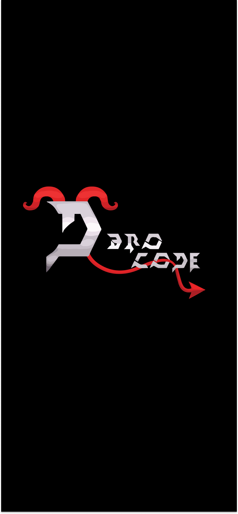
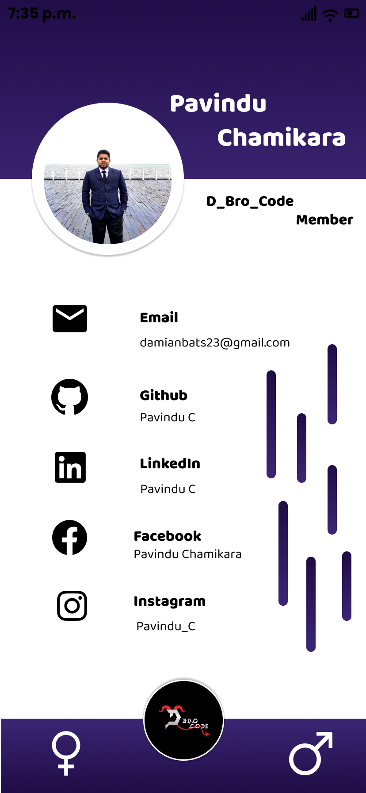

# Profile

Believe that there are no limitations, no barriers to your success – you will be empowered and you will achieve.

## Features

- Male/Female mode toggle
- Live previews
- Fullscreen mode
- Mobile Application

## 🛠 Skills

## Color Reference

| Color                 | Hex                                                                    |
| --------------------- | ---------------------------------------------------------------------- |
| Linear gradient Color |  `#0F0C29` |
| Linear gradient Color |  `#302B63` |
| White Color           |  `#C4C4C4` |
| Purple Color          |  `#5F09B6` |

## Images

## Getting Started

This project is a starting point for a Flutter application.

A few resources to get you started if this is your first Flutter project:

- [Lab: Write your first Flutter app](https://flutter.dev/docs/get-started/codelab)
- [Cookbook: Useful Flutter samples](https://flutter.dev/docs/cookbook)

For help getting started with Flutter, view our
[online documentation](https://flutter.dev/docs), which offers tutorials,
samples, guidance on mobile development, and a full API reference.

## Creators

## Find Us

📫 How to reach Us... ,

## License

