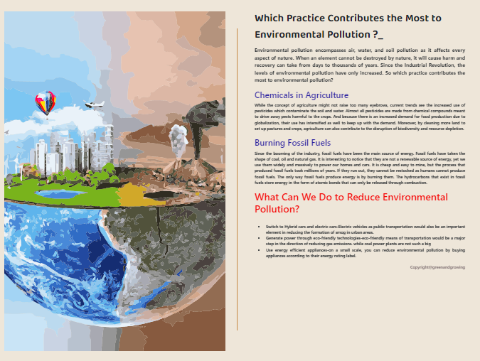

# Article

When we try to pick out anything by itself,we find it hitched to everything else in the universe. 🌱☘️🍀🌎🍃

## Features

- Animation
- Live previews
- Fullscreen mode
- Copyrights

## 🛠 Skills

## Color Reference

| Color        | Hex                                                                    |
| ------------ | ---------------------------------------------------------------------- |
| Orange Color |  `#FDC708` |
| Blue Color   |  `#271D9E` |
| Red Color    |  `#F60707` |
| Grey Color   |  `#8c7e7e` |

## Images

## Creators

## Find Us

📫 How to reach Us... ,

## License

