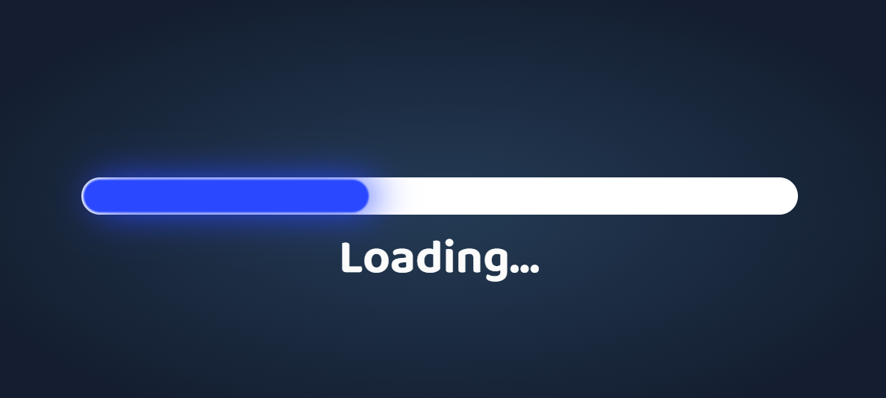

# Loader

Filled with anything? Find an emptiness and let your load flow into it!😉

## Features

- Animation
- Live previews
- Fullscreen mode
- purecss

## 🛠 Skills

## Color Reference

| Color                | Hex                                                                    |
| -------------------- | ---------------------------------------------------------------------- |
| Radial-gradien Color |  `#243B55` |
| Radial-gradien Color |  `#141E30` |
| Blue Color           |  `#2948FF` |
| White Color          |  `#ffffff` |

## Images

## Creators

## Find Us

📫 How to reach Us... ,

## License

