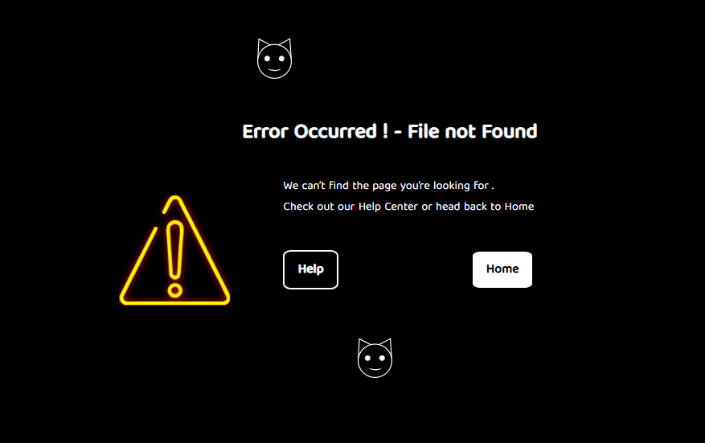

# Warning Page

We are capable of producing anything from a blank slate, but it's difficult to remove errors from an already-scrawled piece of paper.

## Features

- Animation
- Live previews
- Fullscreen mode
- Error

## 🛠 Skills

## Color Reference

| Color       | Hex                                                                    |
| ----------- | ---------------------------------------------------------------------- |
| Black Color |  `#000000` |
| White Color |  `#ffffff` |
| Red Color   |  `#ff0000` |

## Images

## Creators

## Find Us

📫 How to reach Us... ,

## License

