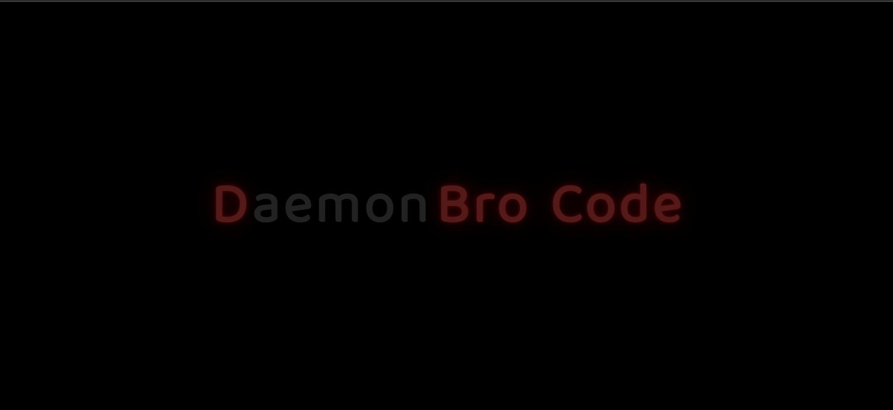

# D Bro Code

There are infinite shadings of light and shadows and colors .. it's an extraordinarily subtle language.Figuring out how to speak that language is a lifetime job.😇

## Features

- Live previews
- Fullscreen mode
- Copyrights

## 🛠 Skills

## Color Reference

| Color        | Hex                                                                    |
| ------------ | ---------------------------------------------------------------------- |
| Gray Color   |  `#484848` |
| Orange Color |  `#FF0000` |

## Images

## Creators

## Find Us

📫 How to reach Us... ,

## License

