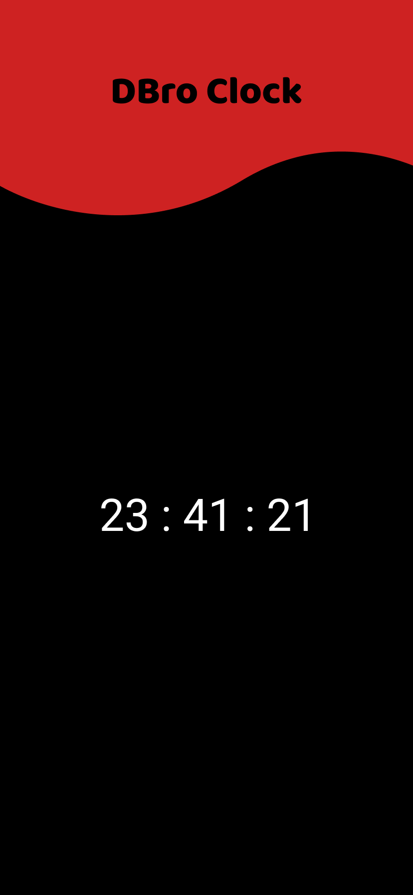

# Clock

Time has a wonderful way of showing us what really matters😇

## Features

- Time
- Live previews
- Fullscreen mode
- Mobile Application

## 🛠 Skills

## Color Reference

| Color                | Hex                                                                    |
| -------------------- | ---------------------------------------------------------------------- |
| Dark Green Color     |  `#00333E` |
| Green gradient Color |  `#006479` |
| White Color          |  `#E7EAF6` |
| Green-White Color    |  `#DDF9FF` |

## Images

## Getting Started

This project is a starting point for a Flutter application.

A few resources to get you started if this is your first Flutter project:

- [Lab: Write your first Flutter app](https://flutter.dev/docs/get-started/codelab)
- [Cookbook: Useful Flutter samples](https://flutter.dev/docs/cookbook)

For help getting started with Flutter, view our
[online documentation](https://flutter.dev/docs), which offers tutorials,
samples, guidance on mobile development, and a full API reference.

## Creators

## Find Us

📫 How to reach Us... ,

## License

