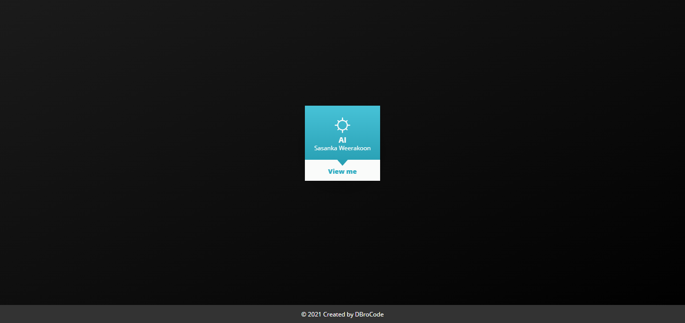

# Card

Reality is that which, when you stop believing in it, doesn't go away.✨

## Features

- Animation
- On mouse action
- Live previews
- Fullscreen mode

## 🛠 Skills

## Color Reference

| Color       | Hex                                                                    |
| ----------- | ---------------------------------------------------------------------- |
| Blue Color  |  `#2aaac1` |
| White Color |  `#fafbfa` |

## Images

## Creators

## Find Us

📫 How to reach Us... ,

## License

